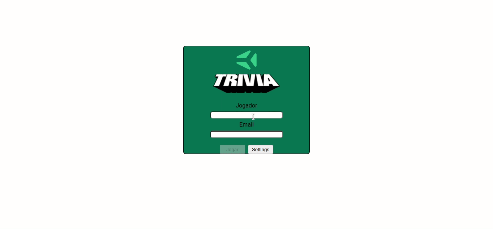

# Project Game Trivia

# Contexto
Este projeto trata-se de um jogo de perguntas e respostas baseado no jogo **Trivia**  _(tipo um show do milhão americano rs)_ utilizando _React e Redux_, desenvolvendo em grupo suas funcionalidades de acordo com as demandas definidas em um quadro _Kanban_.  A partir das demandas do quadro _Kanban_, foi desenvolvida uma aplicação onde a pessoa usuária poderá:

  

- Logar no jogo e, se o email tiver cadastro no site [Gravatar](https://pt.gravatar.com/), ter sua foto associada ao perfil de usuária.

- Acessar a página referente ao jogo, onde se deverá escolher uma das respostas disponíveis para cada uma das perguntas apresentadas. A resposta deve ser marcada antes do contador de tempo chegar a zero, caso contrário a resposta deverá ser considerada errada.

- Ser redirecionada, após 5 perguntas respondidas, para a tela de score, onde o texto mostrado depende do número de acertos.

- Visualizar a página de ranking, se quiser, ao final de cada jogo.

- Configurar algumas opções para o jogo em uma tela de configuração acessível a partir do cabeçalho do app.


Segue abaixo um GIF da aplicação.

  




## Técnologias usadas

Front-end:
> Desenvolvido usando: React e Redux


## Instalando Dependências
``` 
> Frontend
cd game-trivia/
npm install
``` 
## Executando aplicação

* Para rodar o front-end:

  ```
    npm start
  ```

